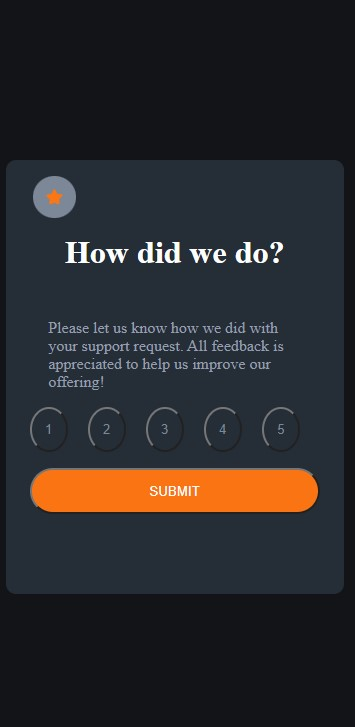

# Frontend Mentor - Interactive rating component solution

This is a solution to the [Interactive rating component challenge on Frontend Mentor](https://www.frontendmentor.io/challenges/interactive-rating-component-koxpeBUmI). Frontend Mentor challenges help you improve your coding skills by building realistic projects. 

## Table of contents

- [Overview](#overview)
  - [The challenge](#the-challenge)
  - [Screenshot](#screenshot)
  - [Links](#links)
  - [Built with](#built-with)
  - [Continued development](#continued-development)
- [Author](#author)

## Overview

### The challenge

Users should be able to:

- View the optimal layout for the app depending on their device's screen size
- See hover states for all interactive elements on the page
- Select and submit a number rating
- See the "Thank you" card state after submitting a rating

### Screenshot

### Links

- Solution URL: [GitHub Repo](https://github.com/DarkPhoenixNinja92/Interactive-Rating-Component)
- Live Site URL: [Live Site](https://darkphoenixninja92.github.io/Interactive-Rating-Component/)

### Built with

- Semantic HTML5 markup
- CSS custom properties
- Flexbox
- Mobile-first workflow
- Javascript

### Continued development

This project wasn't very hard but I've been "off" vanilla javascript for a while and so I'll probably stick with some pretty basic projects for a time just to refine my skills and get up to speed with that stuff again.

## Author

- Website - [Shaun Pour](https://shaunpourdev.com)
- Frontend Mentor - [@DarkPhoenixNinja92](https://www.frontendmentor.io/profile/DarkPhoenixNinja92)
- Twitter - [@yourusername](https://www.twitter.com/yourusername)